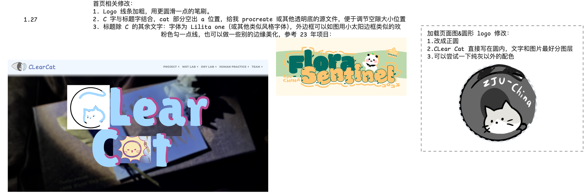

# WP 2024

> 怎么总是设备换着换着就显示又出问题了？:(

## TODO

- [x] sidebar 兼容性调整，展开按钮位置修复
- [x] pages 主体页面在折叠 sidebar 后位置调整
- [x] pages 并列图片窄窗口响应样式调整
- [x] sidebar 样式调整：设置切换动画丝滑一点。
- [x] topbar menu 大纲确定
- [x] 图表，数学公式，内容标题，参考文献
- [x] 鼠标 hover 透图
- [x] list 样式调整
- [ ] 半窄窗口 sidebar 如果太长了会无法显示，需要添加滚动。完全不想修。。
- [ ] quote、table 样式调整
- [ ] 动画效果制作
- [x] description 大致页面内容、大纲排版调试，具体内容等 wet lab 对接了再修改。
- [x] 小猫缩放和图片还未同步
- [x] 成员页面样式调整
- [x] BUG: 滑动某些情况下背景装饰会让 footer 变长。实际上不是 footer 的原因，是动态获取 content-height 的时候拉长了。

## 美工 & 风格

- [x] 首页图效果选择
- [ ] homepage 大纲、相关内容确定
- [x] header svg etc
- [x] list icon 样式

